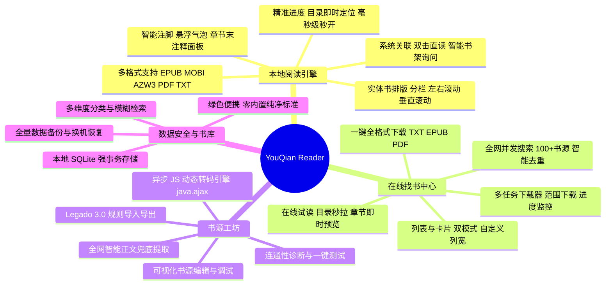

# YouQian书籍阅读器 📚 (V2.1.0)

[](package.json)
[](package.json)
[](package.json)

**YouQian书籍阅读器 (YouQian Reader)** 是一款专为极致阅读体验打造的跨时代桌面电子书阅读器。它完美支持 **EPUB, MOBI, AZW3, PDF, TXT** 等主流格式，配备如实体纸质书般优雅的双栏流式排版，拥有毫秒级瞬开响应与极速翻页交互。

---

## 🚀 V2.1.0 核心功能更新与审计核销完成报告 (Release Notes & Security Audit)

### 1. 🛡️ 外部专项代码审计缺陷全量核销 (Security & Robustness Hardening)
* **S01 书源注入防御 (RCE Elimination)**：彻底移除书源解析模块中的 `new Function` 动态求值机制，改用白名单受控模板替换与安全抽取器，斩断任意远程代码注入风险。
* **S02 TXT 排版容器 XSS 加固**：排版字符与页码测算容器彻底改用安全 DOM `textContent` 构建，杜绝 HTML 标签未转义导致的潜在渲染注入。
* **F01 MOBI / AZW3 解析修复**：修复净化过程中对返回数据结构的处理，保留内容结构体并深度净化 `raw.html`，彻底解决部分 MOBI/AZW3 打开内容空白的异常。
* **F02 在线追更水位与虚假成功根治**：重构小说更新检测机制，在确认追更章节物理写入成功后才持久化推进 `totalChapters` 水位，彻底杜绝网络波动下的假死与虚假更新。
* **F03 & F04 备份恢复全量化与防串书加固**：重构 SQLite 备份恢复引擎，补齐 ONLINE 书籍专属全量字段；恢复时严格根据作者与书源精确配对，杜绝同名小说串书，先全量校验格式合法再原子性提交。
* **F05 & F06 换源时序与下载书签保护**：换源增加请求 ID 来源校验，丢弃陈旧旧源返回；下载书籍重复入库时增加限制，杜绝意外覆盖用户人工书签。
* **F08 TXT 长导语自动序章生成**：识别长达数百字的前置背景与导语，自动生成“【序章/导语】”独立目录项，确保 100% 文本完整可读、可检索。
* **F11 异步书内搜索并发竞态修复**：增加全局单调自增 `searchRequestIdRef` 竞态防护，消除网络或慢检索引起的乱序结果覆盖问题。
* **F13 WebDAV 云端启动自同步链条补齐**：在应用根生命周期中补齐开启“启动时自动同步”后的执行闭环，实现静默拉取与冲突自愈。
* **E01 打包脚本异常守护**：修复发布脚本 7za 工具临时替换的退出时序，确保打包异常时仍能可靠还原开发依赖。
* **D01 开源协议与脱敏防护**：项目根目录正式引入官方 MIT License；`.gitignore` 强化了对设计源文件、测试快照、登录凭据和审计工件的安全隔离。

### 2. 🎯 书库分类切换与格式筛选智能重置
* **分类跳转自愈**：从本地书籍切换至“在线追书”分类时，格式筛选器自动重置为“全部格式”，不再残留本地格式筛选条件，避免追更小说列表被误隐。

---

## 🚀 V2.0.5 历史功能更新 (Historical Release Notes)

### 1. 🌐 阅读 3.0 书源全开放导入引擎 (Network / Local / Paste)
* **全途径一键导入**：支持直接输入网络书源 URL 实时拉取、本地书源 `.json` 文件批量解析导入、以及剪贴板 JSON 内容直接粘贴导入。
* **书源管理工作台**：书源列表支持一键全选/全不选、单项启用/停用、按来源筛选与批量删除。
* **智能字段映射与容错**：自动对齐阅读 3.0 各种变体字段（如 `bookSourceUrl`、`ruleSearch` 等），剔除无效与损坏书源。

### 2. ⚡ 在线小说自动阅读引擎 (Auto-Reading Engine)
* **双模式平滑调度**：左右分页模式下支持秒级倒计时平滑翻页；垂直滚动模式下采用 `requestAnimationFrame` 微积分平滑匀速滚屏。
* **防抢夺暂停机制**：读者手动触摸、鼠标滚轮或键盘干预时，自动微暂停 2.8 秒后平滑续播，杜绝与读者抢夺视野控制权。
* **浮动微型控制胶囊**：底部常驻微型毛玻璃控制条，提供快速调节速度、播放/暂停、随时关闭等无感交互。

### 3. 🧹 文本替换净化规则系统 (Replace Rule Engine)
* **阅读 3.0 净化规则对齐**：支持导入/导出阅读 3.0 净化规则 JSON，内置常用小说网站广告清洗与乱码净化规则。
* **正文断行与排版自愈**：智能清洗粘连段落、规范化字面量换行符与转义符，还原清爽实体书排版。

### 4. 📖 本地 TXT 小说首章智能合并与空前言自愈
* **根治首屏大片空白**：针对《妙手小村医》等本地 TXT，自动识别首章前的书名、作者等微量元数据（< 500 字），将其直接作为第一章卷首展示，正文紧随其后，杜绝将正文推到下一页的割裂感。
* **历史坏目录自愈持久化**：打开已导入书籍时，自动侦测并剔除历史数据库中遗留的伪前言，自动回写数据库完成一键自愈。

### 5. 🛡️ 翻页与页码计算坚固防溢出
* **根治百万页码 Bug**：跨章翻页全面弃用数值魔数，改用安全语义 `'last'`，彻底消除 `1000000/11696` 与状态栏 `100000` 溢出。
* **总页数合理化保底**：为单页估算字符数设置合理保底，消除因极短章节导致的虚假上万总页数。

---

## 🚀 V2.0.4 历史功能更新 (Historical Release Notes)

### 1. 🎨 新增“阅读 3.0 (Legado)”广受好评的经典预设背景
* **6 款经典护眼预设全量引入**：羊皮纸（Sepia）、护眼绿（Green）、远山黛（Cyan）、落霞粉（Peach）、象牙白（Ivory）、暗褐咖啡（Coffee）。
* **全格式智能适配**：EPUB、TXT、MOBI、AZW3、PDF 五大阅读器及全局浮层统一适配，明暗主题下字体对比度自动达到 WCAG AAA 舒适标准。
* **5 列自适应流式网格**：设置面板提供直观颜色预览圆盘与即时选中反馈。

### 2. 🎵 听书朗读沉浸背景伴奏与自然声景系统 (Web Audio API)
* **4 款物理声学纯净声景**：窗外夜雨（Rain on Window）、温暖壁炉（Warm Fireplace）、深林微风（Forest Breeze）、静心和弦（Zen Ambient Chords），基于 Web Audio API 物理信号程序合成，零网络依赖、零延迟、纯净无限平滑循环。
* **伴奏独立音量微调**：支持 5%~80% 细致微调，默认 20% 柔和背景微弱衬托人声，类型与音量本地自动持久化记忆。
* **智能平滑淡入淡出**：朗读开始时伴奏平滑淡入，暂停与停止时轻柔淡出至静音，告别突兀打断。

### 3. 🚀 内生页码专属通道彻底根治听书与翻页联动
* **解决多栏排版（CSS Columns）视口误判**：由阅读器内部直接提供真实页码、总页数与精确段落映射（`registerGetTtsBlocks`），彻底杜绝跳回章节第一句的问题。
* **暂停期间翻页再播放智能感知**：在听书浮岛开启、暂停状态下，读者任意翻页后再次点击播放，系统自动识别并精准从翻到的新页面第一句开读；同一页内暂停则无缝连贯继续。

### 4. ✏️ 划线高亮笔记与跨格式毫秒级精准定位跳转
* **划线系统闭环打通**：解除底层容器禁止选中文本限制，支持多色彩荧光高亮实时渲染与正文点击已有高亮直接修改批注/删除。
* **统一高精度跳转定位器 (`registerJumpTo`)**：书签列表与划线笔记支持在 TXT/EPUB/MOBI/AZW3/PDF 跨格式下秒级精准定位翻页并自动平滑居中展示。

### 5. ☁️ WebDAV 云端同步全系统主题与深色模式跟随
* 同步设置与全量弹窗样式完全跟随当前应用全局主题，无缝融入阅读器视觉体系。

---

## 🚀 V2.0.3 历史功能更新 (Historical Release Notes)

### 1. 🔤 自定义字体管理与原生 FontFace 渲染
* **多格式全覆盖**：支持电脑本地 `.ttf`、`.otf`、`.woff`、`.woff2` 格式字体一键导入。
* **零损耗原生加载**：采用二进制 Buffer 直接注册原生 `FontFace`，全局与阅读器内嵌 iframe 均可实时无缝渲染。
* **便携化存储**：自定义字体文件随项目 `data/custom_fonts` 绿色便携存储，移动软件目录不丢失。

### 2. 🗑️ 自定义字体批量删除与多选管理
* **一键批量管理**：阅读设置面板新增「**批量删除**」管理入口，一键进入批量多选操作模式。
* **灵活多选与全选**：支持单项点击勾选/取消勾选、一键「**全选 / 全不选**」，卡片清晰显示 `☑ / ☐` 状态与醒目红框。
* **安全防误触与智能回退**：二次确认删除弹窗保障数据安全；若删除的字体恰好为当前正在使用的阅读字体，系统自动安全回退至默认字体。
* **智能平滑降级（Fallback）**：前端具备主进程 IPC 通信自动容错与平滑回退，无论客户端是否重启皆可即时正常批量删除。

---

## 🚀 V2.0.2 历史功能更新 (Historical Release Notes)

### 1. 🛡️ 严格健康小说站点认证与木马重定向（Trojan/Redirector）深度拦截
* **木马挂马与恶意跳转拦截**：
  * 针对盗版老旧站点被黑客挂马植入 `Trojan/HTML.Redirector`（强制跳转博彩/钓鱼/恶意下载）的行为，全面封杀 `<meta http-equiv="refresh"` 恶意跳转、`window.location` / `eval(function(p,a,c...` 混淆跳转代码；
  * 大幅扩充博彩、百家乐、六合彩、时时彩、域名出售与假冒空壳特征库。
* **正向小说站健康认证（`isHealthyNovelHtml`）**：
  * 双通道判定升级：即使目标站 HTTP 200 响应，若未搜到书籍，必须通过正向小说站特征认证（必须包含小说、章节、阅读、目录、作者等真实内容特征）；
  * 任何空壳挂马站秒级判定为 `❌ 失败原因: 未搜到图书且涉嫌恶意挂马劫持`，杜绝危险站点。

### 2. ⚡ 阅读 3.0 级极速流水线并发检测引擎（Worker Pool）
* **彻底消灭批次等待木桶效应**：
  * 废除传统的批次等待（`Promise.allSettled(batch)`），重构为高效的**流动并发池（Sliding Worker Pool）**；
  * 30~60 个 Worker 永不停歇，任何一个书源一旦测完（哪怕耗时 0.1s），Worker 立即无缝接取下一个任务，50 线程 100% 满载运行；
  * 2400+ 个书源从原本的数十分钟大幅提速至 **1~2 分钟内极速刷完**！
* **死站毫秒级快速熔断**：
  * DNS 解析失败、拒绝连接或网络超时的死站，首个请求失败即刻熔断，不再做无意义的多词死等。

### 3. 📊 书源失败原因实时可视化记录与卡片展示
* **全生命周期错误捕获**：
  * 批量检测时实时捕获每个书源的具体失败原因（如 `站点无法连接: 连接超时`、`提取到的目录章节列表为空`、`正文内容为空或被反爬拦截`、`搜书超时` 等）并持久化记录。
* **书源卡片醒目标签**：
  * 列表中未通过的书源直接呈现红色标签与详细错误提示，鼠标悬停可查看完整排查信息；
  * 复测成功后自动解除失效标记并清除错误记录。

### 4. 🔴 实时流式勾选与中断 0 延迟瞬间响应
* **边测边标红勾选**：
  * 检测过程中，每测出一个失效书源，下方对应卡片**瞬间变红并自动打上勾选**，进度与状态实时同步；
* **中断 0 毫秒响应**：
  * 点击【🛑 中断检测】时，界面**0 延迟瞬间解除检测状态**并完整呈现已检出的失效书源，方便立即一键批量清除。

### 5. ⚡ 书源管理页面 0 秒毫秒级秒开渲染
* **主进程算法优化**：
  * 将组装 2414 个书源时的 580 万次双重循环比对（$O(N^2)$）重构为 $O(1)$ Hash 查表，主进程耗时直接降为 0 毫秒；
* **渐进式分批秒开渲染**：
  * 首次打开仅渲染首屏 100 个卡片（耗时 < 10ms），彻底消除 React 渲染 36,000+ 个 DOM 节点的 1~2 秒页面冻结；
  * 底部提供“📄 加载更多”与“⚡ 一键加载全部”。

### 6. 🛠️ 阅读 3.0 风格【校验设置】弹窗与无损书源导出
* **校验设置弹窗完全对齐阅读 3.0**：
  * 支持自定义超时时间（默认 180 秒，支持平滑数字输入防误关）、并发线程数调节（2~60 线程）、五大校验维度多选（搜索、发现、详情、目录、正文）；
* **无损导出（Zero-Loss Export）**：
  * 彻底修复导入后再导出导致手机阅读 3.0 换源失败的问题，100% 完整保留原始 `rawLegadoRule`、目录规则、正文规则与正则清洗语法；
* **彻底物理删除修复**：
  * 修复删除书源后依然存在的 bug，精准物理删除磁盘文件（`data/custom_rules/`）并同步黑名单过滤。

---

## 🚀 V2.0.1 历史更新记录 (Historical Walkthrough)

### 1. ⚡ 全链路线程并发调节与防限速抓取控制
* **书源工坊自动化连通性诊断**：
  * 工具栏新增 `⚡ 检测线程` 调节选择器，提供 **`3 线程 (防限速)`**、**`5 线程 (稳健)`**、**`10 线程 (推荐)`**、**`15 线程 (快速)`**、**`20 线程 (极速)`**、**`30 线程 (狂飙)`** 快速切换。
  * 状态全局持久化（`testConcurrency`），页面切换或重启保持记忆。
* **选章下载即时并发调节**：
  * 在【选章下载】弹窗（`ChapterModal`）中新增 `⚡ 3. 并发下载线程数` 模块，支持 **1~16 线程连续平滑滑动调节**。
  * 提供 **防封 2 / 推荐 4 / 极速 8 / 狂飙 16** 四大一键预设档位，直接透传到底层抓取引擎。
  * 底部按钮与通知提示实时动态更新为 `立即下载 EPUB (X章 · Y线程)`。
* **下载管理器配置面板联动**：
  * 下载管理器设置中的并发下载线程数同样补全了快捷档位按钮组，操作更直观。

### 2. 🧪 智能自适应「检测已勾选书源」
* **自适应目标判断**：
  * 当用户在书源列表中手动勾选了若干书源时，主检测按钮自动智能切换为 **`🧪 检测已勾选 (N)`**，仅对勾选的书源执行并发测试。
  * 当未勾选任何书源时，主检测按钮保持为 **`🧪 一键检测全部 (M)`**，支持全量检测。
* **清晰对话框与反馈**：确认弹窗与通知 Toast 准确显示检测范围与线程数。

### 3. 🔄 失效书源专属「低速稳健复测」与智能解封
* **解决并发排队与源站风控误判**：针对批量群测时由于网络排队或小说站防抓取风控导致的误判，提供专属复测通道。
* **专属复测控制栏**：
  * 检测出失效书源后，快捷操作栏自动提供 **复测线程选择器**：`1 线程 (单线程极限防封)` / `2 线程 (双线程防限速)` / `3 线程 (推荐稳健)` / `5 线程 (快速复测)`。
  * 按钮联动显示：**`🔄 立即复测失效 (K线程 · N个)`**。
* **智能解封与自动移出**：
  * 重新复测通过的书源，系统会自动将其**从失效列表中解除**并**取消勾选**；真正失效的书源继续保持勾选，方便随后点击「🗑️ 清除已勾选」。

### 4. 📦 纯绿色真便携化架构 (True Portable)
* **数据目录全面收拢**：
  * 彻底摆脱 Electron 默认向系统 C 盘 AppData 写入数据的限制，将所有数据、数据库、书源与下载小说全部保存在**软件本体（YouQian Reader）目录下**：
    * `YouQian Reader/data/youqian-data.json`：书库索引、阅读进度、书签与偏好设置。
    * `YouQian Reader/data/custom_rules/`：用户导入与自定义的书源规则 JSON 文件。
    * `YouQian Reader/data/download_config.json`：下载并发与网络爬虫配置。
    * `YouQian Reader/downloads/`：在线找书下载生成的 TXT / EPUB / PDF 小说原文件。
* **跨设备与换盘符自适应 (`resolveBookPath`)**：
  * 整个软件文件夹复制到移动硬盘、U盘或发送给朋友电脑后，即使盘符发生变化，书架中保存在 `downloads` 目录下的电子书依然能自适应当前路径，**点击直接秒开**！
* **旧版数据无缝平滑迁移**：
  * 首次启动自动检测并复制系统旧版 AppData 中的数据到本体 `data/` 目录，老书库与进度完全不丢失。

### 5. 📊 实时进度条与运行状态追踪
* 修复并优化进度条实际运行线程数的动态绑定，实时精准反映当前运行的真实并发数。

---

> 📌 **版本定位与纯净标准说明**：
> * **V1.X 系列（经典本地阅读版）**：专注重度本地电子书阅读，毫秒级解析大体积 EPUB/MOBI/AZW3/PDF/TXT，**不含任何在线网络找书模块**。
> * **V2.X 系列（全能聚合与转码下载版）**：全新重磅升级！在保持 V1.X 极致阅读体验的基础上，新增 **【全网在线找书】**、**【书源工坊自定义管理】** 与 **【全本一键转码下载（TXT / EPUB / PDF）】**。
> * **零内置纯净原则**：**本软件原始不内置/预置任何默认书源规则**（初始书源数为 0），书源完全由用户按需自主导入（支持开源阅读 3.0 / Legado JSON 规则）或在书源工坊中自主创建，彻底保持绿色纯粹。

---

## 🗺️ 全功能架构图景



---

## 🌟 核心功能详解

### 📖 一、 核心本地阅读引擎（V1.X & V2.X 共有）

#### 1. 全主流电子书格式原生支持
* **EPUB 电子书**：基于双模渲染引擎，精准解析书籍内置 CSS 样式、内嵌字体、高清图文混排与多级目录结构。
* **MOBI / AZW3 电子书**：独创原生 Records 二进制解析器与 Huffman 算法解密提取引擎，**百万字大部头书籍毫秒级“瞬开”**，彻底攻克了传统阅读器常见的“目录超链接无法跳转”、“开书卡死”等底层难题。
* **PDF 电子书**：基于现代 PDF 渲染引擎，支持高清矢量/Canvas 缩放、目录大纲快速导航、单页/双页多栏排版。
* **TXT 纯文本**：支持 **GBK / GB2312 / UTF-8 / UTF-16** 等全编码自动探测与防乱码加载；针对超长篇幅小说，采用**物理分片与虚拟滚动渲染**，加载上万章亦丝滑零卡顿。

#### 2. 实体书级优雅排版系统
* **智能分栏排版**：自适应左右视口分栏排版，如同翻开一本精美的实体纸质书。
* **三种阅读视口模式一键切换**：
  * **全窗口模式**：经典单页/双栏版式，专注沉浸。
  * **左右滚动模式**：带纸张跨栏质感的平滑横向翻页。
  * **上下滚动模式**：连贯流畅的垂直瀑布流滚动。
* **个性化视觉微调**：字号缩放、行间距、段落间距、首行缩进定制；内置明亮白昼、麦香护眼、水墨羊皮纸、深邃暗黑等主题配色。

#### 3. 创新智能注释与注脚系统
* **鼠标跟随气泡预览**：自动将书中复杂的注脚转换为优雅的上标。鼠标轻触悬停，即刻弹出自适应防遮挡气泡查看释义，移开即消。
* **章节末【本章注释】面板**：在每章正文结束处自动汇总该章节所有注释，省去翻至全书末尾查注的繁琐。

#### 4. 系统文件关联与极速直读
* **双击文件秒开阅读**：支持关联 Windows 系统右键及双击直接打开电子书，直入阅读界面。
* **智能书架询问**：关闭临时阅读窗口时，自动检测书籍是否入库并询问是否加入书库，纯净不打扰。

---

### 🌐 二、 全网在线找书中心（V2.0 独占）

#### 1. 百源并发极速搜索与智能提纯
* **并发聚合检索**：支持对用户导入的数十乃至上百个书源进行秒级异步并发检索，流式快速上屏。
* **智能去重与相关度排序**：自动合并不同书源的同名图书，按书名完全匹配度、作者精准度与更新状态智能加权排序。
* **元数据智能提纯**：自动剥离章节冗余前缀，自动将 Unix 时间戳转换为 `YYYY-MM-DD` 标准日期。

#### 2. 灵活的双视图浏览模式
* **列表模式 (Table View)**：高度对齐终端风格的规整表格，展示【序号、书名、作者、最新章节、最后更新时间、来源书源、操作列】，支持鼠标按住表头边框**自由拖拽调整列宽**。
* **卡片模式 (Grid View)**：图文并茂的瀑布流卡片，直观浏览封面与书籍简介。

#### 3. 在线试读与目录即刻预览
* **秒级拉取目录**：无需下载整书，点击【📖 预览】即可瞬间拉取最新章节目录。
* **平滑试读体验**：支持在线试读任意章节，支持字号调整与上一章/下一章平滑切换。

#### 4. 全格式一键直接转码下载
在搜索列表或预览界面中，可直接一键将网络小说编译打包并存入书库：
* **📄 TXT 格式**：快速下载为规范的纯文本小说，自动净化广告。
* **📚 EPUB 格式**：自动封装为标准 **EPUB 3.0** 电子书，内置书籍封面、精美排版样式与多级目录。
* **📑 PDF 格式**：自动排版并生成带**书签大纲目录、高清封面、实体书页眉与页码**的高清 PDF 电子书。

#### 5. 多任务下载管理器
* 支持多任务并行下载与进度条实时监控。
* 支持**章节范围下载**（如仅下载前 100 章或指定区间）。
* 下载完成后支持“一键直接阅读”或“打开所在文件夹”。

---

### ⚙️ 三、 书源工坊与规则引擎（V2.0 独占）

#### 1. 深度兼容开源阅读 3.0 (Legado)
* **标准规则导入/导出**：完美支持一键导入或导出网络通用的 Legado 3.0 JSON 书源规则文件。
* **Legado 异步 JS 执行引擎**：支持 `<js>...</js>` 与 `@js:` 动态规则，内置 `java.ajax(...)`（轻松破解转码防盗接口）、`java.md5Encode`、`java.timeFormat`、`org.jsoup.Jsoup` 及 `CryptoJS` 运行环境。
* **JSONPath 解析**：支持直接通过 `$.info`、`$.data.content` 等表达式提取 JSON 数据。

#### 2. 全网智能正文兜底提取器 (Smart Fallback)
* **代码防泄露机制**：自动拦截规则错误泄露的代码字符串。
* **通用智能容器嗅探**：一旦书源规则失效，系统自动扫描网页中的正文特征容器（`#content`、`.read-content`、`#chaptercontent`、`div.showtxt` 等），按中文段落密度智能提纯，确保 100% 呈现干净小说正文。

#### 3. 可视化书源管理与连通性测试
* **规则可视化编辑**：提供清晰的编辑表单，支持调试搜索、目录、正文及详情页规则。
* **连通性体检与诊断**：支持一键批量测试书源网络状态，自动识别失效或反爬拦截站点。

---

### 💾 四、 书库管理与数据安全

#### 1. 本地书架与高效管理
* **多视图书架**：支持书架网格视图与详细列表视图。
* **分类与标签**：支持自定义书籍分类，支持按书名、作者、阅读进度进行实时模糊检索与过滤。
* **阅读进度记忆**：自动精确记忆每本书的滚动位置、章节与阅读时间。

#### 2. 零联网隐私与全量数据备份
* **本地 SQLite 强事务数据库**：所有阅读记录、书签与书源规则全部存储在本地，保护隐私。
* **一键全量备份与迁移**：支持一键将书架、阅读进度、所有书签及全局偏好导出为 JSON 备份文件，换机时一键无缝恢复并智能重建图书封面。
* **零内置纯净标准**：安装包与初始运行状态**零预置任何网络书源**，彻底保持绿色纯粹。

#### 3. 📦 纯绿色真便携化架构 (True Portable)
软件的所有数据全部完整收拢于**软件本体目录**中，零污染系统盘（不向 C 盘写任何私有数据），随拷随走：
```text
YouQian Reader/
├── YouQian Reader.exe        # 软件主程序 (或绿色免安装目录)
├── data/                     # 核心数据与配置目录
│   ├── youqian-data.json     # 书库索引、阅读进度、书签与偏好设置
│   ├── download_config.json  # 下载并发与爬虫配置
│   └── custom_rules/         # 用户导入与自定义的书源规则 JSON 文件
└── downloads/                # 在线下载小说生成目录 (TXT / EPUB / PDF)
```
* **跨设备与换盘符自适应**：无论是放在 U 盘、移动硬盘还是发送给朋友，换机或变更盘符后书架书籍依然能直接秒开。
* **平滑无感升级**：首次启动自动检测并迁移旧版系统 AppData 数据，平滑无缝。

---

## 🛠️ 项目技术栈

* **桌面框架**：[Electron](https://www.electronjs.org/) (保障应用在桌面端的稳定表现与原生系统互操作)
* **前端界面**：[React](https://react.dev/) + [Vite](https://vite.dev/) (模块化开发与极致热更新体验)
* **状态管理**：[Zustand](https://github.com/pmndrs/zustand)
* **本地数据库**：SQLite 强事务本地化存储
* **格式解析引擎**：
  * **EPUB**: [Epub.js](http://epubjs.org/) + 自研 DOM 样式适配器
  * **PDF**: [PDF.js](https://mozilla.github.io/pdf.js/) + Canvas/SVG 矢量渲染
  * **MOBI / AZW3**: 自主开发的原生 Records 结构及 Huffman 解密提取引擎
  * **TXT**: 多编码自动嗅探 + 智能章节正则物理分片分块引擎
  * **EPUB / PDF 生成器**: 自研标准 EPUB 3.0 打包器与 PDFKit 矢量大纲构建器

---

## 🚀 快速开始

### 1. 检出与环境准备
确保本地安装了 [Node.js](https://nodejs.org/) (推荐 v18+)。

```bash
# 1. 克隆代码仓库
git clone https://github.com/thousy/youqian-reader.git

# 2. 进入项目根目录
cd youqian-reader

# 3. 安装依赖
npm install
```

### 2. 启动开发模式
```bash
npm run dev
```

### 3. 生产编译与打包
```bash
# 仅执行打包编译
npm run build

# 执行构建并打包为 Windows 独立便携运行程序 (.exe) 与绿色压缩包 (.zip)
npm run package
```

### 4. 自动化发布 (仅开发人员)
```bash
# 执行打包并将构建出的最新版 zip/exe 上传至 GitHub Release
npm run publish
```

---

## 📄 开源许可证

本项目基于 **MIT License** 许可协议开源。详情参见 [LICENSE](LICENSE) 文件。

